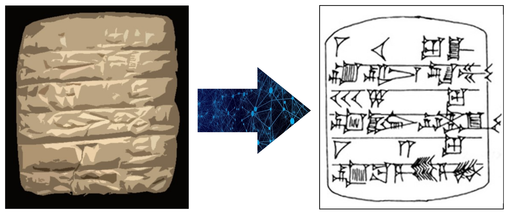
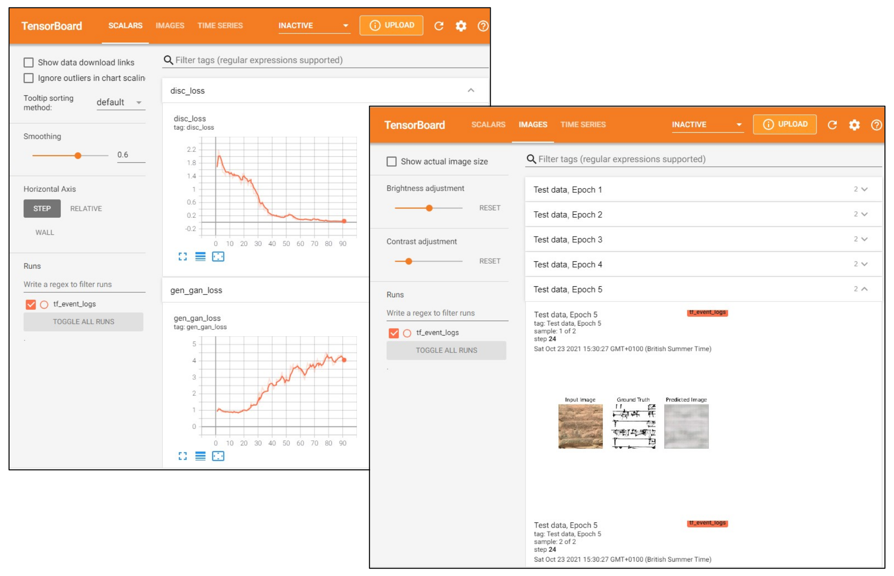
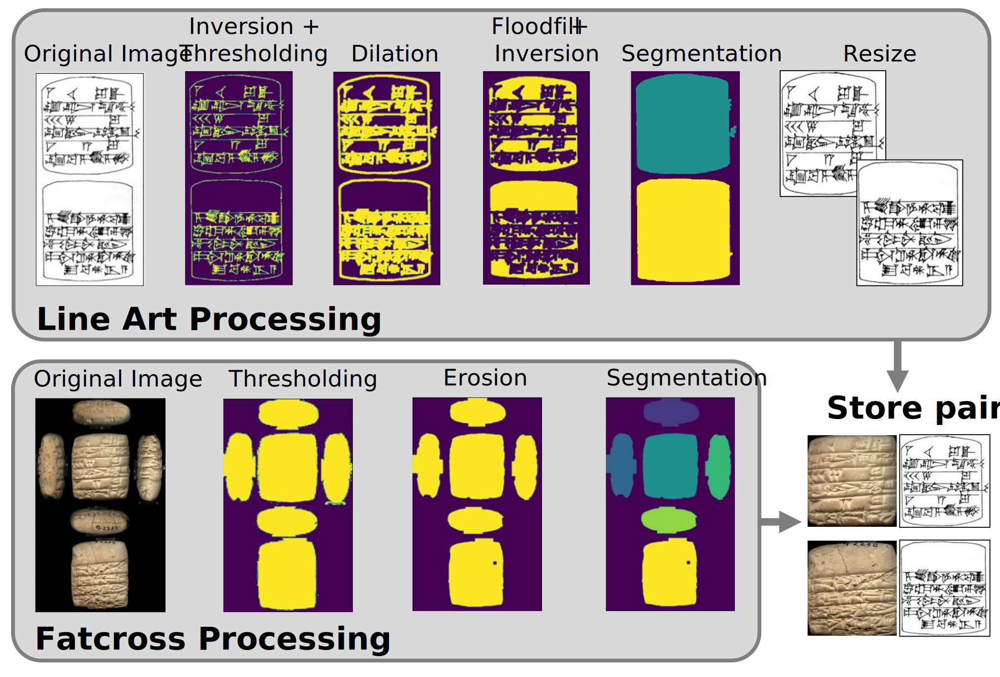

# Line Art Generator for Cuneiform Tablets

This project is intended to automate the time-intensive process of creating
line art from a cuneiform tablet via deep learning.

Cuneiform is an early writing system that was used across the Ancient Near
East, characterized by groups of wedge-shaped signs.  It dates from
approximately the late 4th millennium BCE (early Bronze Age) to the first
century CE. Cuneiform was used to record documents in mulitple languages, 
such as Sumerian and Assyrian, and it influenced the development of many other
scripts.  Extant cuneiform records royal achievements, religious writings,
laws, accounting documents, and more. 

## Dataset

The data set (photographs and hand-produced line art) used in this project has
been compiled and made publicly available by the Cuneiform Digital 
Library Initiative (CDLI), a collaborative project between the University of 
California, Los Angeles, the University of Oxford, and the Max Planck Institute
for the History of Science, Berlin, with collaborators from across the world.

The full CDLI data set provides photographic documentation, line art, 
transliterations and translations for hundreds of thousands of tablets from
public and private collections.  A comprehensive Wiki has also been created, 
offering archaeological and linguistic analyses, and far more.  Go to the [CDLI 
homepage](https://cdli.ucla.edu/) to explore more of this vast resource.

## Installation

This package has been developed using Python 3.9.0 and TensorFlow 2.5.0, on a
Windows machine.  Some of the commands below may need to be translated if you
are using this on a different operating system.  

Tensorflow is not included in the requirements.txt, as it can be installed
either with or without GPU support (more details 
[here](https://www.tensorflow.org/install)).  Currently this repository does
not heavily use the GPU, therefore it is fine to run it without enabling GPU
training.  For CPU-only training, you can install Tensorflow simply by running:

    pip install tensorflow 

It is recommended to run the following package in a virtual environment (e.g. 
using venv or virtualenv).    

    git clone https://github.com/laclark/cuneiform_lineart.git
    cd cuneiform_lineart
    pip install -r requirements.txt
    pip install -e .

## Quickstart - Training a Toy Model

### **Download and Preprocess Data**

CDLI numbers for six selected tablets are stored in quickstart_tablet_ids.txt. 
This is a tiny data set, used to train a toy model that will both test your
installation and show you some interesting patterns that develop at the very 
beginning of the model's learning process.

From the root directory of the repository:

    cd lineart_generator

Download photographs and line art for these tablets.  This script will create 
a new directory (*cuneiform_lineart\data\raw_data*), where it will store the
downloaded photographs and line art for each tablet in a separate subdirectory.

    python data_munging/cdli_data_download.py --cdli_list_path=../quickstart_tablet_ids.txt

Process the photos and line art into separate tablet faces (front/obverse and
back/reverse).  Another new directory will be
created to store the processed, matched images for training
(*cuneiform_lineart\data\processed_data\quickstart_data*).  Again, photographs
and line art for each set of faces are stored in separate subdirectories.

    python data_munging/cdli_data_preparation.py --name=quickstart_data

It is important that the model is trained with accurate data,
and the current data preparation script does not segment well if there are
large gaps in the line art outlines around a tablet's face.  An example of this
can be seen if you look at the raw data and processed data for the following 
tablets: 
* P102635
* P102650

For each of these tablets, the obverse face was correctly segmented and the
reverse face was not.  Compare the segmented tablet faces in the 
*processed_data\quickstart_data* subdirectories, *lineart_rev* and 
*lineart_obv* with the combined line art in *cuneiform_lineart\data\raw_data* for each
tablet. You should be able to see the gaps that caused the problems!  

Now that you have seen what can occur when segmentation goes awry, these images
should be removed from the directory so that they are not used for training. 
If working in a Windows CMD shell, you can delete the incorrect data by running
the following command.  Double check the file locations and follow the prompt when it
appears. 

    del /p ..\data\processed_data\quickstart_data\lineart_rev\P102635.jpg  ^
    ..\data\processed_data\quickstart_data\lineart_rev\P102650.jpg  ^
    ..\data\processed_data\quickstart_data\photo_rev\P102635.jpg    ^
    ..\data\processed_data\quickstart_data\photo_rev\P102650.jpg

Or in a Linux shell, this would be:

    rm ../data/processed_data/quickstart_data/*rev/P102635.jpg       \
    ../data/processed_data/quickstart_data/*rev/P102650.jpg

Note that you need to delete the line art *and* the photo for the faces that
were incorrectly processed. 

### **Train the Model**

Start the model training.

    python pix2pix/train.py --model_name=quickstart_model --data_dir=../data/processed_data/quickstart_data --train_proportion=0.8 --epochs=15

Model training with such a small dataset and for only fifteen epochs means that
training should take less than five minutes.

### **Monitor Training Progress**

During and after training, you can check training progress over time (loss +
image generation capabilities) by using TensorBoard.

Open a new command window, and activate the same virtual environment you used
for training.  Go to the root directory of the repository and run:

    tensorboard --logdir .

TensorBoard recursively searches for and displays any nested summary files.

Follow the directions to see your model's training progress.  It may take a few
seconds after training has started for any data to appear on
TensorBoard.  You should see something like the following screenshots.  

If you explore the *TensorBoard Images* tab, you should see that the model has
been able to learn and produce some basic characteristic structures very
quickly: the predominantly white backgrounds, customary horizontal
black lines and hints of angular black shapes should be visible by about epoch
10.

## Further Information

### **Model Architecture/Training**

The network being trained is a conditional generative adversarial network
(cGAN) known as pix2pix (Isola et al., 2017).  Given an input, a GAN learns how
to generate a transformed output by training two *adversarial* networks in
concert.
* The *generator* learns to produce the correct
transformation from the given input.   
* The *discriminator* learns to distinguish between the generated output and
the user-provided ground truth.    

If both parts of the network learn at the same time, remaining 'balanced', the
network should begin to produce outputs that are closer and closer to the desired
transformation.  The *conditional* aspect of a cGAN means that both generator
and discriminator are allowed to see the ground truth, i.e. the network is 
*conditioned* on the input.  An incredibly diverse set of artistic applications
of the pix2pix approach is collected 
[here](https://ml4a.github.io/guides/Pix2Pix/), and is well worth a look!

Much of the training code here 
has been adapted from the pix2pix tutorial provided by Tensorflow 
(https://www.tensorflow.org/tutorials/generative/pix2pix).  While the code is 
documented, for more detailed explanations, please see this resource.

### **Image Processing**

CDLI tablets are documented via composite photographs ('fatcrosses') and hand
drawn line art that emphasizes salient features of each tablet. Details about
this painstaking process can be found
[here](https://cdli.ox.ac.uk/wiki/doku.php?id=submission_guidelines).

#### Fatcrosses

Fatcrosses are a type of composite photographic record that shows every side
of a tablet in a standardized format.  An example can be seen in the image
below.  

#### Line Art

Line art styles vary significantly across the CDLI corpus.  Cuneiform signs are
always present, and any underlying/overlying layers of writing or engraved art
are also likely to be present.  The line art often (but not always) shows both 
main sides (obverse and reverse) of the tablet separately. In some styles, the
cuneiform and the tablet itself including any damage are drawn in a spare but
naturalistic style.  In other cases, the cuneiform signs are extracted and
written in regimented rows much like a poem, and there is no indication of
their relation to the tablet itself.  

#### Preprocessing

In order to create a training dataset, the input photograph and ground truth
line art for a tablet face must match as precisely as possible.  This means
that the fatcrosses and line art images must be decomposed into individual
faces, matched, and resized.  A tablet's front and back faces are identified in
the fatcross and line art images with morphological operations, then each face
is extracted (tight cropping) from the original image.  Extracted line art
images are resized to match the photographic images exactly.  The morphological
operations are described in the schematic below.  It is important to note that
the current algorithm is not particularly robust, so stored training images
should be examined carefully prior to model training or evaluation.   

### **Building Your Own Data Set**

Considering the range of tablets available through the CDLI database, there is
huge scope for training models that 'specialize' in different kinds of data or
produce different styles of line art.  Be aware that not all tablets listed in
the CDLI catalogue have both photos and line art available. Use the 
'lineart_up' and 'photo_up' columns in the CDLI Catalogue to check.

#### CDLI Data Catalogue

In order to create a data set, you will need to download the CDLI data
catalogue.  This catalogue not only defines the P-number for each tablet, 
without which the URLs for downloading images cannot be constructed,
but it also includes a variety of useful information about each tablet's source, 
physical description, and so forth.

To obtain the catalogue, either clone the CDLI repository 

    git clone https://github.com/cdli-gh/data.git

or go to https://github.com/cdli-gh/data and download the
data as a zip, then extract into another directory.

Descriptions of many of the fields in the CSVs are found at
https://cdli.ucla.edu/cdli-search-information.

#### Data Preparation and Training

The same download and preparation scripts used in the Quickstart can be used to
create your own data set for model training and testing.  It should be noted
that the current line art segmentation script is not particularly robust, and
it is unlikely to work across the whole range of line art styles available.  So
you should take care to inspect the matched faces after data processing and
remove any that have not worked correctly.  It may be faster for some styles
to download the raw data using the provided script, then process them by hand
into matching faces.

In general, models will be most generalizable when they are provided with a
broad range of data for training.  However, it may also be much more difficult
for the model to converge to a good solution when presented with 'noisy' data. 
Given the broad range of data available through the CDLI, you may wish to
consider how the following might affect your results when creating a data set:
* line art style (naturalistic vs. simplified, tablet outline vs. no outline)
* language
* period
* surface preservation
* material

## Resources

* Cuneiform Digital Library Initiative. (2021). CDLI Online Database. https://cdli.ucla.edu.

* Isola, P., Zhu, J-Y., Zhou, T., and Efros, A. (2017). Image-to-Image Translation with Conditional Adversarial Networks. 2017 IEEE Conference on Computer Vision and Pattern Recognition (CVPR), 2017, pp. 5967-5976, doi: 10.1109/CVPR.2017.632. Accessed via https://arxiv.org/abs/1611.07004.

* pix2pix: Image-to-image translation with a conditional GAN. (2021). [TensorFlow Tutorial]. https://www.tensorflow.org/tutorials/generative/pix2pix.